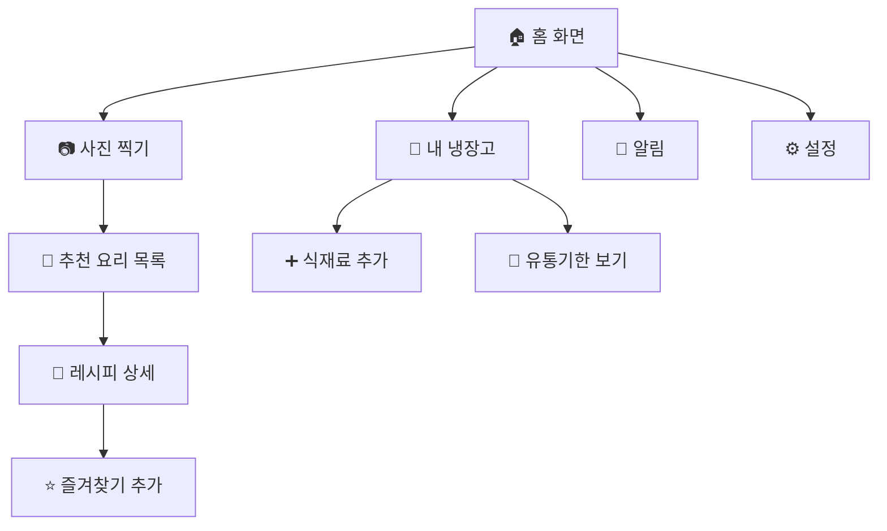
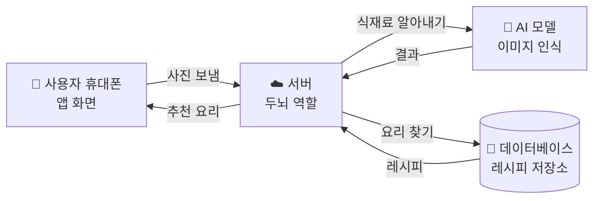
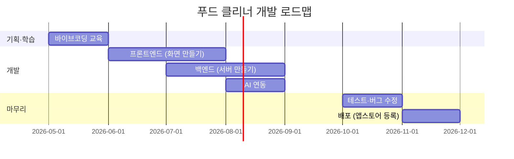

# 🍳 푸드 클리너 (Food Cleaner) — 개발 기획서

> **한 줄 소개**: 냉장고에 있는 식재료 사진만 찍으면, AI가 만들 수 있는 요리와 레시피, 유통기한까지 알려주는 모바일 앱
>
> **만든 사람**: 권정범 (동도중 1학년)
> **작성일**: 2026년 6월 7일
> **버전**: v1.0 (초안)

---

## 📖 이 문서를 읽는 방법

이 기획서는 코딩을 처음 배우는 사람도 이해할 수 있도록 만들었습니다.
어려운 단어가 나오면 바로 옆에 **💡 쉬운 설명**을 달아두었어요.

순서는 이렇게 읽으시면 됩니다:
1. **1장**: 우리가 왜 이 앱을 만드는지 (배경)
2. **2장**: 누가 이 앱을 쓸지 (사용자)
3. **3장**: 앱이 무엇을 할 수 있는지 (기능)
4. **4장**: 화면이 어떻게 생겼는지 (디자인)
5. **5장**: 어떤 기술로 만들지 (기술)
6. **6장**: 언제까지 만들지 (일정)
7. **7장**: 다음에 무엇을 해야 하는지 (할 일)

---

## 1장. 📌 프로젝트 개요

### 1.1 프로젝트 이름
**푸드 클리너 (Food Cleaner)**
→ "냉장고를 깨끗하게(Clean) 비워주는 음식(Food) 도우미"라는 뜻

### 1.2 왜 이 앱을 만드는가? (문제 상황)
- 사람들은 마트에서 식재료를 잔뜩 사 옵니다.
- 그런데 **무엇을 만들지 몰라서** 그냥 냉장고에 둡니다.
- 결국 식재료가 썩어서 **버리게 됩니다** → 돈 낭비 + 환경 오염

### 1.3 우리의 해결책
> "냉장고를 열고 사진 한 장만 찍으면, 만들 수 있는 요리가 짠! 하고 나타나는 앱"

### 1.4 기대 효과
| 항목 | 변화 |
| --- | --- |
| 💸 가계 | 음식물 쓰레기가 줄어 돈을 아낄 수 있다 |
| 🌱 환경 | 버려지는 음식이 줄어 환경 보호 |
| 🍽️ 식생활 | 다양한 요리에 도전하게 된다 |
| ⏱️ 시간 | 메뉴 고민·검색 시간이 줄어든다 |

---

## 2장. 👤 누가 쓰는 앱인가? (타깃 사용자)

### 2.1 메인 페르소나
> 💡 **페르소나**: 우리 앱을 쓸 "가짜로 만든 대표 사용자". 실제 사람처럼 구체적으로 적어 두면 기능을 만들 때 헷갈리지 않습니다.

| 항목 | 내용 |
| --- | --- |
| 이름·나이 | 홍길동 / 23세 |
| 직업·상황 | 자취 1년차 대학생 |
| 불편함 | 식재료를 사 놓고 활용할 줄 모른다 |
| 바라는 점 | 있는 재료로 만들 수 있는 요리를 알려주면 좋겠다 |
| 성격 | 상상력이 풍부하지 않음 |
| 습관 | 검색하는 걸 귀찮아함 |
| 관심사 | 요리, 자취 살림 |
| 한마디 | "가진 식재료를 입력하면 만들 수 있는 음식을 알려주면 좋겠다" |

### 2.2 사용자가 앱을 만나기 전과 후
| 단계 | 앱이 없을 때 😞 | 앱이 있을 때 😊 |
| --- | --- | --- |
| 1. 식재료를 산다 | 기쁨 | 기쁨 |
| 2. 냉장고에 넣는다 | 행복 | 행복 |
| 3. 뭘 만들지 모른다 | 불안 ⚡ | **사진 찍고 추천 받기** |
| 4. 식재료가 썩어 간다 | 귀찮음 ⚡ | **유통기한 알림** |
| 5. 검색하기 귀찮다 | 슬픔 ⚡ | **레시피 자동 표시** |
| 6. 결국 버렸다 | 슬픔 | **다 먹어서 뿌듯함** |

> ⚡ 표시한 곳이 **우리 앱이 끼어들 부분**입니다.

---

## 3장. ⚙️ 앱은 무엇을 할 수 있는가? (기능 명세)

> 💡 **기능 명세**: "이 앱은 이런 일을 할 수 있어요"를 자세히 적은 목록.

### 3.1 핵심 기능 (MVP)
> 💡 **MVP (Minimum Viable Product)**: "최소한 이것만은 꼭 있어야 하는" 기본 기능. 욕심내지 말고 이것부터 만듭니다.

#### ✅ 기능 1: 식재료 사진 → 요리 추천
- **무엇을**: 사용자가 냉장고 안 사진을 찍는다
- **앱이 하는 일**:
  1. 사진에서 식재료를 알아낸다 (예: 계란, 양파, 감자)
  2. 그 재료로 만들 수 있는 요리 3~5가지를 추천한다
- **결과 화면**: "이걸로 만들 수 있어요! → 계란말이, 감자전, 오므라이스 ..."

#### ✅ 기능 2: 요리 레시피 보여주기
- **무엇을**: 추천 요리 중 하나를 누른다
- **앱이 하는 일**: 그 요리의 만드는 방법(재료, 순서, 시간)을 알려준다
- **결과 화면**: "1단계: 양파를 썬다 → 2단계: ..."

#### ✅ 기능 3: 유통기한 알림
- **무엇을**: 식재료를 산 날짜를 입력하거나 영수증을 찍는다
- **앱이 하는 일**: 유통기한이 다가오면 알림을 보낸다
- **결과 화면**: "🔔 우유가 3일 후에 유통기한이에요!"

### 3.2 추가 기능 (⭐ 심화)
도전해 볼 수 있는 기능들 — **MVP가 완성된 후에** 만듭니다.

| 기능 | 설명 | 어려움 |
| --- | --- | --- |
| 요리 스타일 필터 | 한식/양식/일식 중에서 고르기 | 쉬움 ⭐ |
| 즐겨찾기 | 마음에 든 레시피 저장 | 쉬움 ⭐ |
| 가족 공유 | 같은 냉장고를 가족과 같이 관리 | 어려움 ⭐⭐⭐ |
| 알러지 필터 | "땅콩 제외" 같은 옵션 | 보통 ⭐⭐ |
| 쇼핑 리스트 | 부족한 재료 자동 정리 | 보통 ⭐⭐ |

### 3.3 기능 우선순위 매트릭스

```
            중요도 ↑ 높음
        ┌────────────────────┬────────────────────┐
        │ ② 도전               │ ① 반드시 구현       │
        │                    │                    │
        │ • 사진 → 요리 추천  │ • 유통기한 알림     │
        │   (AI 필요)        │ • 레시피 보기      │
        │                    │                    │
        ├────────────────────┼────────────────────┤
        │ ④ 과감히 빼기        │ ③ 여유 되면        │
        │                    │                    │
        │ • 가족 공유         │ • 요리 스타일 필터  │
        │                    │ • 즐겨찾기         │
        │                    │                    │
        └────────────────────┴────────────────────┘
        ← 어려움                          쉬움 →
```

---

## 4장. 🎨 앱은 어떻게 생겼나? (화면 설계)

### 4.1 전체 화면 흐름 (네비게이션)



### 4.2 핵심 화면 4개

#### 화면 1: 🏠 홈 화면
> 사용자가 앱을 열면 처음 보이는 화면

```
┌──────────────────────────┐
│   안녕하세요, 길동님 👋    │  ← 헤더
├──────────────────────────┤
│                          │
│   📷 [큰 사진 찍기 버튼]   │  ← 핵심 액션
│                          │
├──────────────────────────┤
│ 🔔 곧 유통기한:           │
│   • 우유 (3일 남음)       │
│   • 양파 (5일 남음)       │
├──────────────────────────┤
│ 🍳 오늘의 추천 요리:       │
│   [요리 카드] [요리 카드]  │
├──────────────────────────┤
│ 🏠 📷 🥬 🔔 ⚙️           │  ← 하단 네비게이션
└──────────────────────────┘
```

#### 화면 2: 📷 사진 찍기
```
┌──────────────────────────┐
│  ← 뒤로                   │
├──────────────────────────┤
│                          │
│  [카메라 화면]            │
│                          │
│  💡 냉장고 안이 잘 보이게  │
│     찍어주세요             │
│                          │
├──────────────────────────┤
│      ⚪ (촬영 버튼)        │
└──────────────────────────┘
```

#### 화면 3: 🍳 추천 요리 목록
```
┌──────────────────────────┐
│ ← 분석된 재료: 계란, 양파  │
├──────────────────────────┤
│ ┌─────┐ 계란말이          │
│ │이미지│ ⏱ 10분  ⭐ 4.8   │
│ └─────┘                  │
├──────────────────────────┤
│ ┌─────┐ 양파 수프         │
│ │이미지│ ⏱ 20분  ⭐ 4.5   │
│ └─────┘                  │
├──────────────────────────┤
│ ┌─────┐ 오므라이스        │
│ │이미지│ ⏱ 15분  ⭐ 4.9   │
│ └─────┘                  │
└──────────────────────────┘
```

#### 화면 4: 📖 레시피 상세
```
┌──────────────────────────┐
│ ← 계란말이      ⭐ 즐겨찾기 │
├──────────────────────────┤
│  [요리 사진]              │
├──────────────────────────┤
│ ⏱ 10분  👤 1인분  🔥 쉬움 │
├──────────────────────────┤
│ 📋 재료                   │
│  • 계란 3개               │
│  • 양파 1/2개             │
│  • 소금 약간              │
├──────────────────────────┤
│ 👨‍🍳 만드는 법             │
│  1. 양파를 잘게 썬다       │
│  2. 계란을 풀어 양파를 섞다 │
│  3. ...                  │
└──────────────────────────┘
```

> 💡 **규칙**: 핵심 기능(사진 → 추천)까지 **3번 안에 도달**해야 좋은 앱입니다. 우리 앱은 홈 화면에서 1번만 누르면 카메라가 열리므로 OK!

---

## 5장. 🛠️ 어떤 기술로 만드는가? (기술 스택)

> 💡 **기술 스택 (Tech Stack)**: 앱을 만들 때 쓰는 도구·재료의 모음. 요리로 치면 "어떤 칼, 어떤 냄비, 어떤 양념"을 쓸지 정하는 것.

### 5.1 우리 앱을 만들기 위해 필요한 것



### 5.2 각 부분이 하는 일

| 부분 | 비유 | 추천 도구 | 왜? |
| --- | --- | --- | --- |
| **프론트엔드** (화면) | 식당의 홀 | **Flutter** 또는 **React Native** | 한 번 만들면 안드로이드/아이폰 둘 다 됨 |
| **백엔드** (서버) | 식당의 주방 | **Node.js** + Express | 배우기 쉽고 자료가 많음 |
| **데이터베이스** | 식당의 창고 | **Firebase** | 무료로 시작 가능, 설정이 간단 |
| **AI 이미지 인식** | 주방장의 눈 | **Google Cloud Vision** 또는 **OpenAI API** | 사진 → 식재료 변환을 대신 해줌 |
| **알림 보내기** | 종업원 | **Firebase Cloud Messaging** | 무료, 푸시 알림용 |

> 💡 **프론트엔드 / 백엔드**:
> - **프론트엔드 (Front-end)** = "앞쪽"이라는 뜻. **사용자가 보는 화면**.
> - **백엔드 (Back-end)** = "뒷쪽"이라는 뜻. **눈에 안 보이는 서버**. 데이터 저장·계산을 함.

### 5.3 처음 배우는 사람이 알아야 할 단어 5가지

| 단어 | 뜻 (쉬운 말로) |
| --- | --- |
| **API** | 두 프로그램이 서로 이야기하는 통로. (전화기 같은 것) |
| **데이터베이스** | 정보를 체계적으로 모아 둔 큰 엑셀 같은 것 |
| **서버** | 24시간 켜져 있는 컴퓨터. 사용자 요청을 받아 처리함 |
| **클라이언트** | 사용자가 들고 있는 휴대폰·노트북 |
| **배포 (Deploy)** | 만든 앱을 사람들이 쓸 수 있도록 인터넷에 올리는 것 |

---

## 6장. 📅 언제까지 만들 것인가? (개발 일정)

### 6.1 전체 일정 (8개월)



### 6.2 월별 할 일

| 월 | 단계 | 주요 활동 | 결과물 |
| --- | --- | --- | --- |
| **5월** | 바이브코딩 교육 | 코딩 기초, 도구 사용법 학습 | "Hello World" 앱 |
| **6월** | 화면 만들기 | 4개 핵심 화면 디자인 + 코딩 | 클릭 가능한 시제품 |
| **7월** | 서버 만들기 | 데이터베이스 설계, API 만들기 | 레시피 검색 가능 |
| **8월** | AI 연결 | 사진 → 식재료 인식 기능 | MVP 완성! 🎉 |
| **9월** | 추가 기능 | 알림, 즐겨찾기 등 | 베타 버전 |
| **10월** | 테스트 | 친구·가족에게 써보게 하기 | 버그 리스트 → 수정 |
| **11월** | 배포 | 앱스토어/플레이스토어 등록 | 출시! 🚀 |

### 6.3 마일스톤 (꼭 지켜야 할 큰 약속)

> 💡 **마일스톤 (Milestone)**: 마라톤의 "10km 지점, 20km 지점"처럼 **꼭 통과해야 하는 중간 목표**.

- 🏁 **M1 (6월 말)**: 화면이 클릭되는 프로토타입 완성
- 🏁 **M2 (8월 말)**: 사진을 찍으면 요리 추천이 뜨는 MVP 완성
- 🏁 **M3 (10월 말)**: 실제 사람들이 써보고 만족하는 베타 버전
- 🏁 **M4 (11월 말)**: 스토어에 출시 ✨

---

## 7장. ✅ 지금 당장 무엇을 해야 하나? (To-Do)

### 7.1 이번 주에 할 일 (6/7 ~ 6/14)
- [ ] 사전과제 1 (창의적 컴퓨팅 사고력 문제) 완료
- [ ] 사전과제 2 (심화 과제) 완료
- [ ] 5월 바이브코딩 교육 자료 복습
- [ ] 친구·가족 3명에게 "이 앱 쓸 것 같아?" 물어보기

### 7.2 6월 안에 할 일
- [ ] **Figma** 같은 무료 디자인 도구로 화면 4개 그려보기
  - 💡 **Figma**: 누구나 무료로 쓸 수 있는 디자인 그림판
- [ ] **Flutter** 또는 **React Native** 중 하나 선택
- [ ] "Hello World" 앱 만들어 휴대폰에 띄워 보기
- [ ] 멘토에게 기획서 보여주고 피드백 받기

### 7.3 위험 요소 (미리 대비할 것)

| 위험 | 대비 방법 |
| --- | --- |
| AI가 식재료를 잘 못 알아본다 | 사용자가 직접 재료를 수정할 수 있게 만든다 |
| 레시피 데이터가 부족하다 | 공공 레시피 데이터(만개의레시피, 농촌진흥청)를 이용한다 |
| 혼자 만들기 너무 어렵다 | 멘토에게 적극적으로 질문하고, 기능을 줄인다 |
| 사용자가 사진 찍기 귀찮아한다 | 텍스트로 재료 입력하는 방법도 추가한다 |

---

## 8장. 🤝 개발자 마인드셋 (잊지 말 것)

> Day 1에서 배운 5가지 — 어려울 때마다 다시 읽기!

1. **완벽보다 시작**: 일단 해보자. 고치면 된다.
2. **실패는 데이터**: 안 되는 방법을 하나 찾은 것이다.
3. **사용자 먼저**: 내가 아닌, 사용자를 위해 만든다.
4. **혼자보다 함께**: 모르면 멘토·친구에게 묻는다.
5. **윤리적 책임**: 만드는 사람에게는 책임이 따른다.

### 나의 다짐
> "나, **권정범**은(는) 냉장고 식재료가 버려지는 문제를 해결하기 위해 **푸드 클리너**를 기획했습니다.
> 이 앱의 핵심은 **사진 한 장으로 요리 추천을 받는 것**이며,
> 앞으로 8개월간 이 프로젝트를 끝까지 완수하겠습니다."
>
> 2026. 6. 7. / 권정범

---

## 📎 부록: 용어 사전

| 용어 | 한 줄 설명 |
| --- | --- |
| MVP | 최소한 동작하는 기본 버전 |
| 프로토타입 | 진짜처럼 보이지만 안은 비어있는 가짜 모델 |
| UI / UX | UI = 화면 모양, UX = 쓰는 느낌 |
| 디버깅 | 코드의 오류(벌레, Bug)를 잡는 작업 |
| 깃 (Git) | 코드의 "저장 기록"을 남기는 도구 (게임 세이브와 비슷) |
| 깃허브 (GitHub) | 깃으로 관리한 코드를 인터넷에 올리는 곳 |
| 라이브러리 | 이미 만들어진 코드 묶음. 가져다 쓰면 시간 절약 |
| 프레임워크 | 앱의 뼈대를 미리 만들어 놓은 큰 도구 (Flutter, React 등) |

---

📌 **이 기획서는 살아 있는 문서입니다.**
앞으로 8개월간 계속 업데이트하면서, 나만의 앱을 끝까지 만들어 가세요! 🚀
